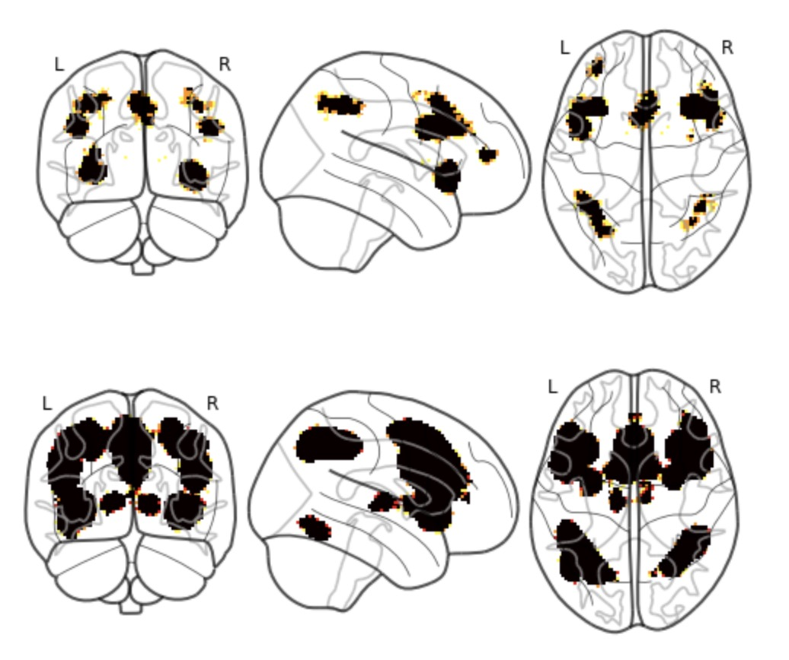
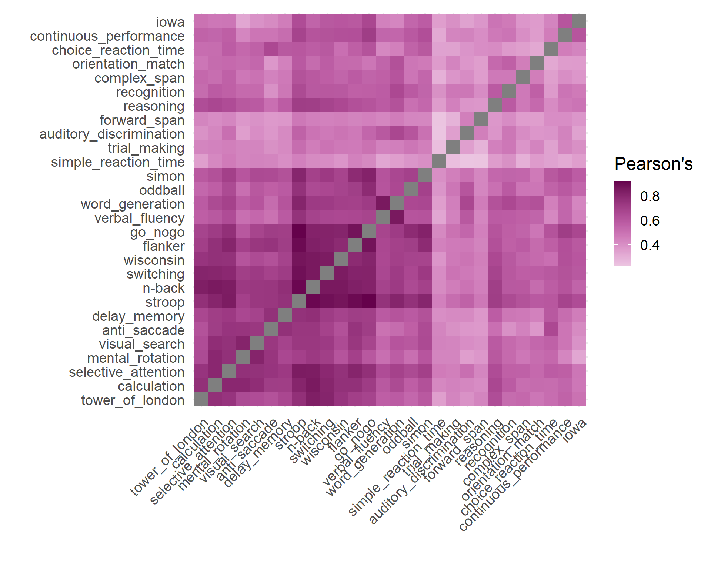
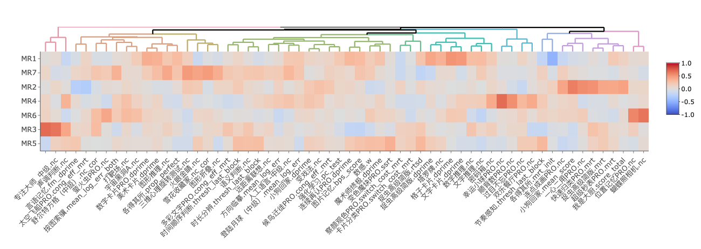
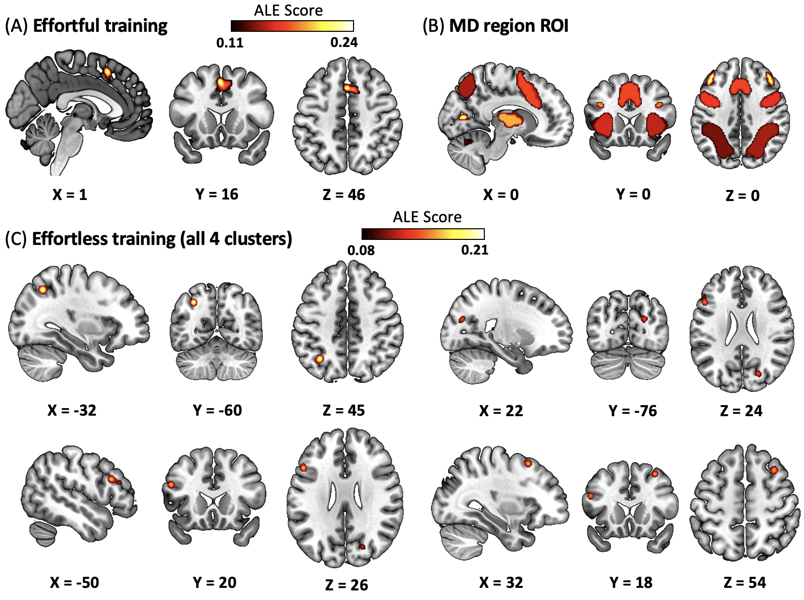
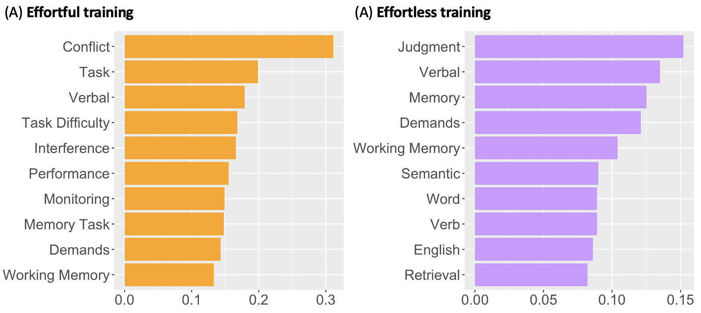

### Master Studies

#### Neuroscience Center Zurich (ZNZ)

At present, I study Interdisciplinary Brain Science at both University of Zurich and ETH Zurich. The program covers three main blocks: (1) Brain Biology, (2) Systems, Computation and Neural Technology, (3) Translational, Clinical and Cognitive Neuroscience. Through intensive course and lab rotation, I be equipped with multidisciplinary neuroscience knowledge and skills.

For my first project, I am collaborating with [Prof. Silvia Brem](https://www.kjpd.uzh.ch/de/multimod/neuroimaging/team/brem.html) to investigate the multisensory learning process of children using reinforcement learning model, drift diffusion model, and fMRI. And for my second project, I am collaborating with [Prof. Philippe Tobler](https://www.econ.uzh.ch/en/people/faculty/tobler.html) to investigate the neural mechanism of habit formation using computational modeling and fMRI.

#### IDG/McGOVERN Instute for Brain Research (Beijing Normal University)

From 2021 to 2023, I studied cognitive neuroscience in the master program at Beijing Normal University. In the [Center for Brain and Cognitive Learning Science](https://cbls.bnu.edu.cn/index.htm), I was supervised by [Prof. Gui Xue](https://brain.bnu.edu.cn/English/Faculty/CurrentFaculty/Xzz/d293370178f744b0a72c00d82d1117d7.htm) and investigated the cognitive and neural architecture of human intelligence. Combining with large-scale behavioral testing, task and resting state fMRI scanning, we aimed at finding the core of human intelligence and its related neural indices. Besides these, I also collaborated with Xiaojing Peng and Dr. Liang Shi to investigate human sequence memory with computational modeling and fMRI.

### Undergraduate Studies

#### Northeast Normal University

From 2017 to 2021, I studied in Northeast Normal University, majoring in Psychology. At first, I conducted developmental psychology research on infants' joint attention with [Prof. Minxuan He](https://directory.msmary.edu/people/minxuan-he.html). After that, I turned my research direction to the development and plasticity of human executive functions (EF). Collaborating with [Prof. Yuan Wang](https://www.researchgate.net/profile/Yuan-Wang-132), we used meta-analysis, fNIRS scanning, behavioral experiment to investigate the role of cognitive training on individuals' EF and brain activities.

