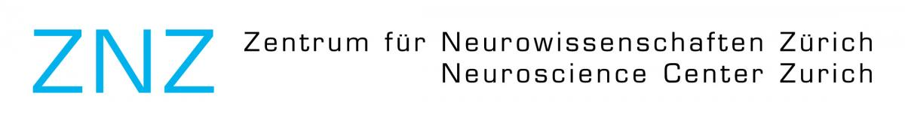

### Master Studies

#### Neuroscience Center Zurich (ZNZ)

At present, I study Interdisciplinary Brain Science at both University of Zurich and ETH Zurich. The program covers three main blocks 

#### IDG/McGOVERN Instute for Brain Research (Beijing Normal University)

From 2021 to 2023, I studied cognitive neuroscience in the master program at Beijing Normal University

### Undergraduate Studies

#### Northeast Normal University

From 2017 to 2021, I studied in Northeast Normal University, majoring in Psychology.

