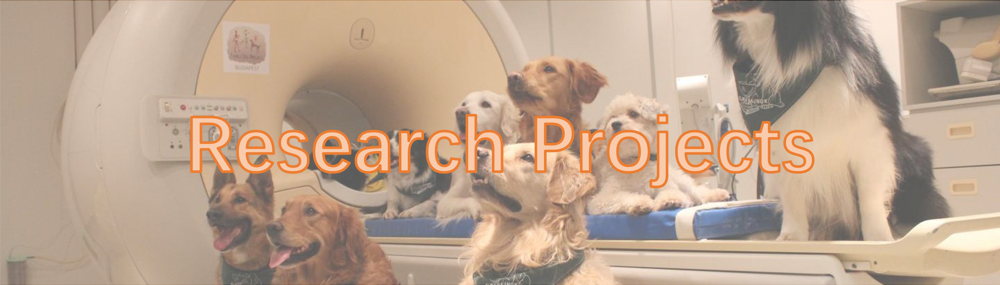

### [Neural Pasis of multisensory learning and processing during child development (ChildBrainCircuits)](https://www.adabd.uzh.ch/en/research/path3.html)

#### Supervisors
Prof. Silvia Brem
Nina Rauder

### The process of habitization, its neural implementation and clinical application

#### Supervisors
Prof. Philippe Tobler
Dr. Stephan Nebe

