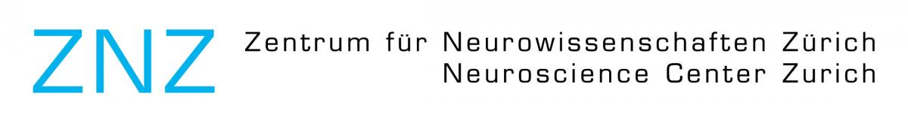
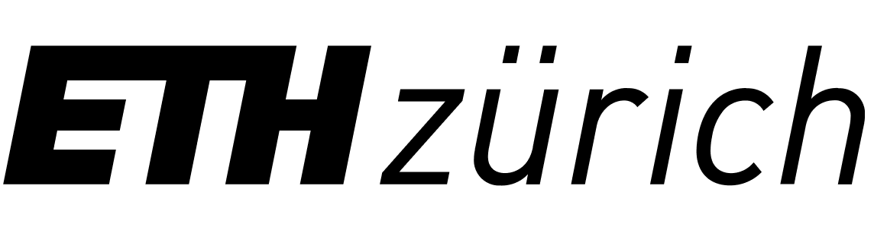
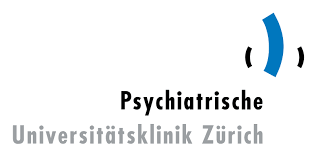
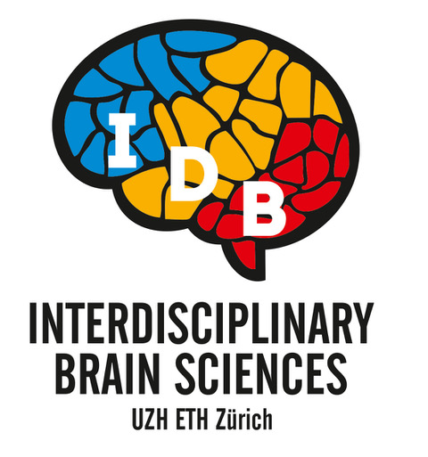

# **Welcome**

Welcome to Yifei Cao's personal website. Yifei is a student studying in the [Interdisciplinaty Brain Science (IDB)](https://www.neuroscience.uzh.ch/en/Master-Studies/IDB-Overview.html) Program hosted in [Neuroscience Center Zurich (ZNZ)](https://www.neuroscience.uzh.ch/en.html) and which is affiliated with the [Faculty of Science](https://www.mnf.uzh.ch/en.html) at the University of Zurich and the [Department of Health Sciences and Technology (D-HEST)](https://hest.ethz.ch/en) of the ETH Zurich.

## My Research Roles

1. fork the repo for this website and follow instructions on read me to get set up. [https://github.com/CrumpLab/LabJournalWebsite](https://github.com/CrumpLab/LabJournalWebsite)

2. Blog/journal what you are doing in R, by editing the Journal.Rmd. See the [Journal page](https://crumplab.github.io/LabJournalWebsite/Journal.html) for an example of what to do to get started learning R.

3. See the [links page](https://crumplab.github.io/LabJournalWebsite/Links.html) for lots of helpful links on learning R.

4. Change everything to make it your own.

### [Affiliations](https://www.neuroscience.uzh.ch/en.html)

</a>

